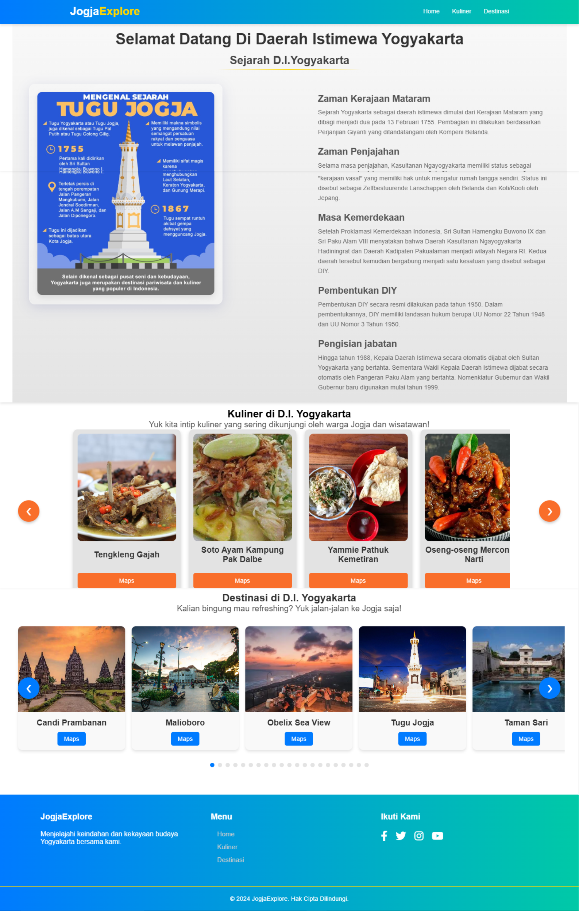

# 🌟 JogjaExplore - Jelajahi Keindahan Yogyakarta

  

  
  

## 🎯 Overview

JogjaExplore adalah platform web interaktif yang menghadirkan pesona Daerah Istimewa Yogyakarta dalam bentuk digital. Didesain dengan pendekatan modern dan responsif, website ini menjadi jendela virtual untuk menjelajahi sejarah, kuliner, dan destinasi wisata di Kota Gudeg.

## ✨ Fitur Utama

### 📜 Sejarah & Budaya
- Eksplorasi sejarah Yogyakarta dari era Mataram hingga modern
- Informasi mendalam tentang warisan budaya
- Dokumentasi visual berkualitas tinggi

### 🍜 Kuliner Khas
- **20+ Rekomendasi Kuliner**
  - Makanan tradisional
  - Cafe & resto modern
  - Street food legendaris
- Integrasi dengan Google Maps
- Galeri foto kuliner HD
- Informasi harga & jam operasional

### 🗺️ Destinasi Wisata
- **20+ Lokasi Wisata**
  - Candi & situs bersejarah
  - Destinasi alam
  - Spot fotografi
- Navigasi lokasi terintegrasi
- Tips kunjungan
- Virtual preview

## 🛠️ Tech Stack

## 📱 Kompatibilitas

| Platform | Status | Tested |
|----------|--------|--------|
| Desktop  |   ✅   |   ✅   |
| Tablet   |   ✅   |   ✅   |
| Mobile   |   ✅   |   ✅   |

## 🚀 Cara Menggunakan

1. **Beranda**
   - Scroll untuk membaca sejarah
   - Nikmati visual interaktif

2. **Kuliner**
   - Geser carousel untuk eksplorasi kuliner
   - Klik card untuk detail
   - Akses maps untuk navigasi

3. **Destinasi**
   - Browse destinasi wisata
   - Lihat preview & informasi
   - Dapatkan petunjuk arah

## 🤝 Kontribusi

Kami sangat menghargai kontribusi Anda! Berikut langkah-langkah untuk berkontribusi:

1. Fork repository
2. Buat branch fitur (`git checkout -b feature/FiturKeren`)
3. Commit perubahan (`git commit -m 'Menambahkan Fitur Keren'`)
4. Push ke branch (`git push origin feature/FiturKeren`)
5. Buka Pull Request

## 📝 Panduan Kontribusi
Struktur folder
jogjaexplore/
├── assets/
│ ├── css/
│ ├── js/
│ └── images/
├── index.html
└── README.md

## 👨‍💻 Pengembang

Proyek ini dikembangkan oleh:

**Rizqulloh Rifqi Edwanto**
- Pengembang Utama
- Email: rizqulloh@gmail.com
- GitHub: [@rizqulloh](https://github.com/TruflleBlack)

## 📞 Kontak

- Email: rizqullohr93.com
- Instagram: [@rizqullr](https://instagram.com/rizqullr)
- LinkedIn: [Rizqulloh Rifqi Edwanto](https://www.linkedin.com/in/rizqulloh-rifqi-edwanto/)

---

